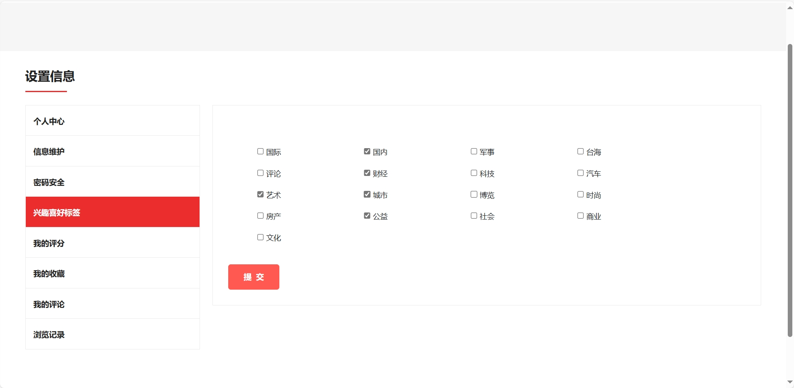
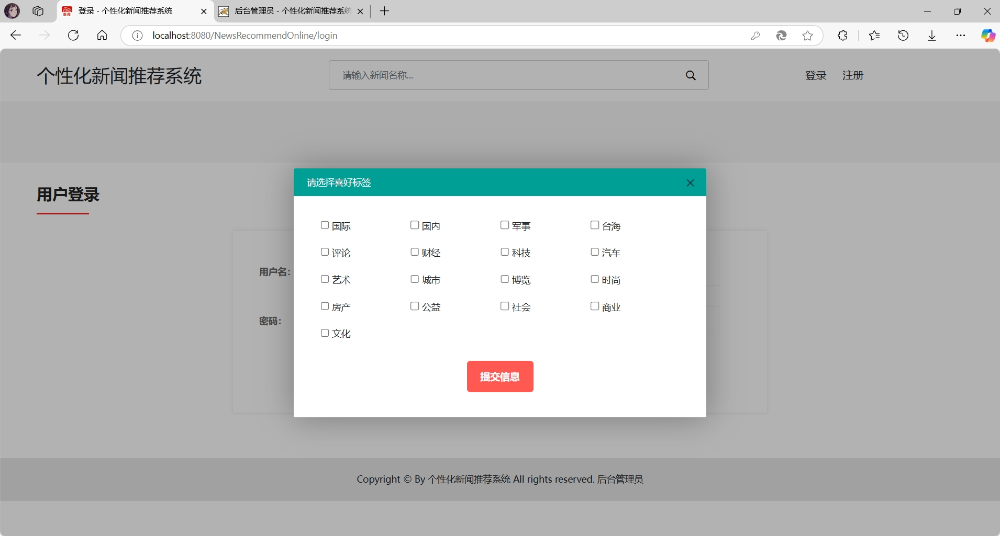
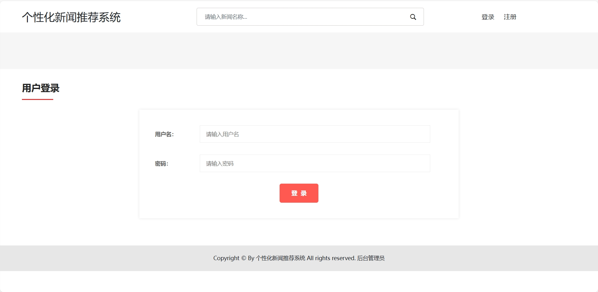
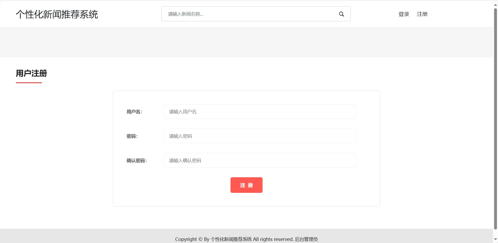
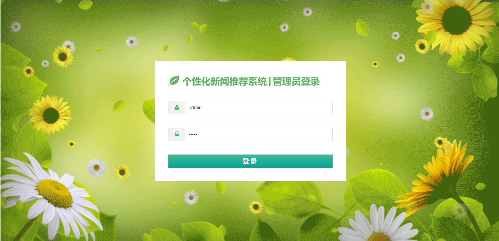
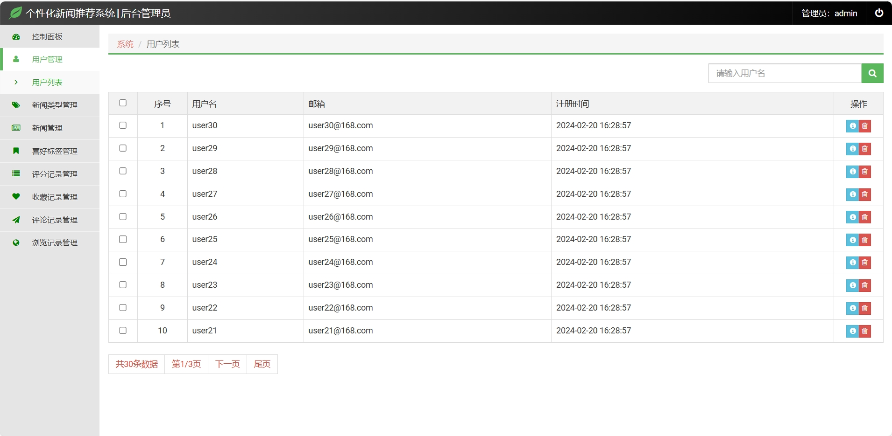
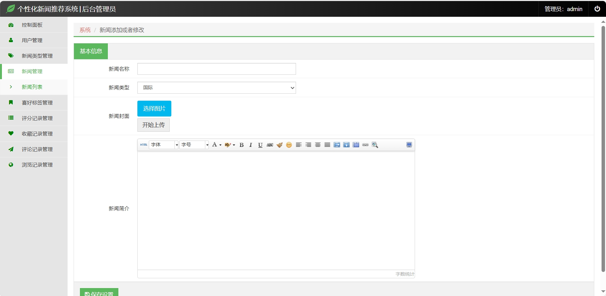

# 协同过滤在线新闻推荐网站系统

## 基于Java的协同过滤算法个性化在线新闻推荐系统

#### 介绍
使用Java语言**SpringBoot和SSM两种框架实现**基于协同过滤算法的个性化新闻推荐系统，使用了基于用户的协同过滤推荐算法，根据评分数据计算推荐，同时还使用了新用户喜好标签进行混合推荐，及将两种推荐结果全部输出，解决了冷启动和数据稀疏性问题。同时采用基于统计的热点推荐和相关推荐等。采用爬虫收集新闻数据实时更新新闻数据和推荐结果。

Java语言**SpringBoot和SSM**(Spring+SpringMVC+Mybatis)**两种框架分别实现**+Mysql基于用户的协同过滤算法个性化新闻推荐系统，采用基于用户、项目、内容、聚类、混合的协同过滤推荐算法。

 **源码获取：** [协同过滤算法个性化新闻推荐系统源码.zip](https://github.com/user-attachments/files/18202253/default.zip)

**（服务器配置低，访问可能会有点慢）**

**系统在线演示地址**

前台：http://1.95.71.218:8081/NewsRecommendOnline/

后台：http://1.95.71.218:8081/NewsRecommendOnline/admin/login

**第二款在线演示地址**

前台：http://1.95.71.218:8090/WebNewsRecommendSystem/

后台：http://1.95.71.218:8090/WebNewsRecommendSystem/admin/login

### 一、项目简介

**项目创新点**：
使用了基于用户的协同过滤推荐算法，根据评分数据计算推荐，同时还使用了新用户喜好标签进行混合推荐，及将两种推荐结果全部输出，解决了冷启动和数据稀疏性问题。同时采用基于统计的热点推荐和相关推荐等。

**冷启动**：一个新用户第一次登录，没有评分和收藏数据，那么没有办法进行个性化推荐；

**数据稀疏性**：会伴随项目的整个运行过程，比如：项目刚上线，新闻数据很多，但是用户及用户的评分、收藏数据较少，用户之间没有交集，那么有些用户就没有推荐结果

**1、开发工具和实现技术**
IDEA，jdk1.8，mysql5.5/mysql8，navicat数据库管理工具，tomcat7，**SpringBoot和SS**M（spring+springmvc+mybatis）**两种开发框架分别实现**，javascript脚本，jquery脚本，bootstrap前端框架，layer弹窗组件，webuploader文件上传组件等。

**2、项目功能**

**前台用户包含**：注册、登录、注销、浏览新闻、搜索新闻、信息修改、密码修改、新闻评分、个人中心，新闻收藏、新闻评论、新闻浏览、用户喜好标签、热点推荐、个性化推荐新闻等功能；

**后台管理员包含**：数据统计、用户管理、新闻管理、新闻类型管理、评分管理、收藏管理、评论管理、用户喜好标签管理、浏览记录管理等。

**个性化推荐功能**：

**游客**：展示热点推荐（根据新闻被收藏数量降序推荐）

**登录用户**：同时进行 基于用户的协同过滤推荐算法进行推荐（根据评分数据）和 基于喜好标签的推荐（根据登录用户的喜好标签随机推荐）

### 系统功能展示

**1,前台用户系统**

**游客**：

**登录用户**：

**2，后台管理系统**

**3，协同过滤推荐算法展示**

 **源码获取：** [协同过滤算法个性化新闻推荐系统源码.zip](https://github.com/user-attachments/files/18202254/default.zip)
